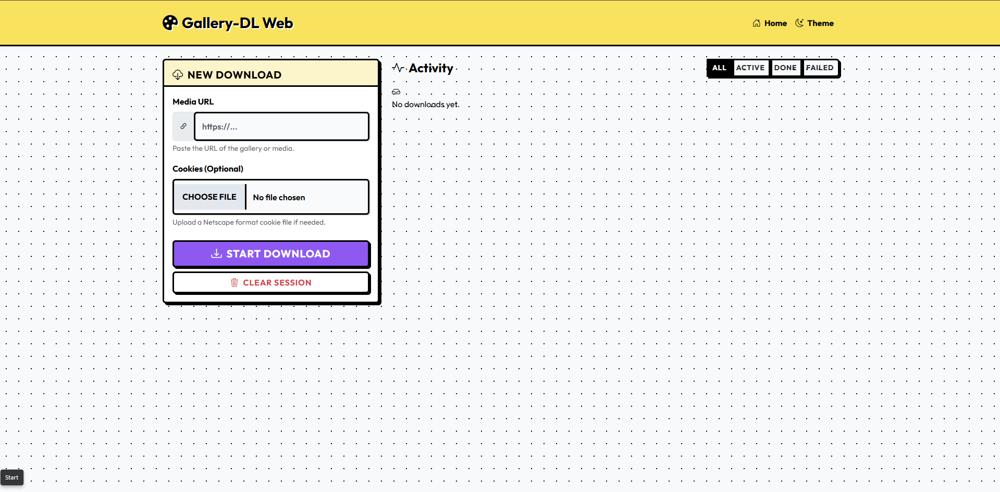
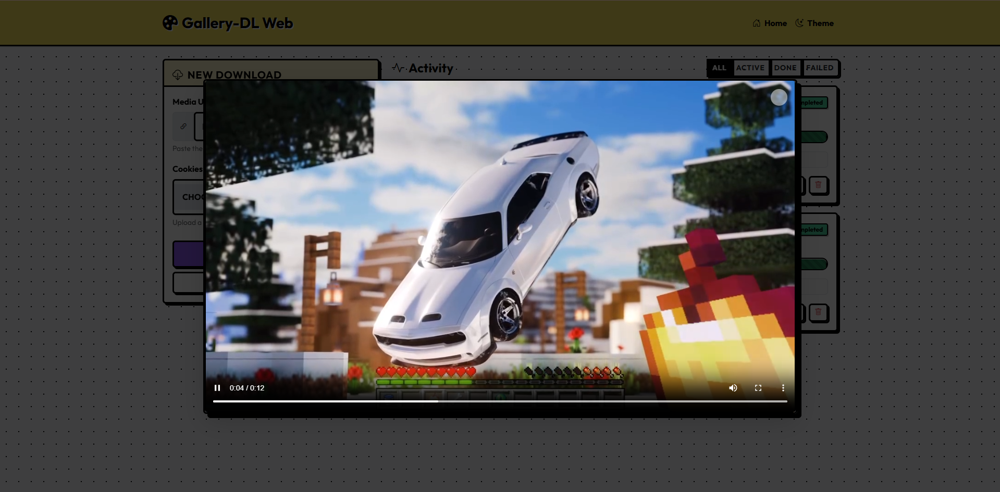

# Gallery-DL Web Interface (GDL-Web)

A web-based user interface for the [gallery-dl](https://github.com/mikf/gallery-dl) command-line tool that allows users to download media from various online platforms through an intuitive web interface. The application provides real-time download status tracking, session management, and secure cookie handling for authenticated downloads.



## 🌟 Features

- **Web-based Interface**: User-friendly web interface for gallery-dl with responsive design
- **Real-time Status Tracking**: Live progress updates for all active downloads
- **Session Management**: Isolated download sessions per user with automatic cleanup
- **Cookie Support**: Secure handling of authentication cookies for private content
- **File Management**: Browse and download completed media files
- **Filtering**: Filter downloads by status (in-progress, completed, failed)
- **Retry Logic**: Automatic retry mechanism for failed downloads due to network issues
- **Security**: Secure cookie encryption, path traversal protection, and input validation
- **Multi-user Support**: Session-based isolation to support multiple concurrent users

## 📸 Gallery

| Dashboard | Download Progress |
|:---:|:---:|
|  |  |
| **File Inline View** | **Video Preview** |
|  |  |

## 🛠️ Tech Stack

- **Backend**: Python Flask web framework
- **Frontend**: HTML5, CSS3, JavaScript (no external dependencies)
- **Download Engine**: [gallery-dl](https://github.com/mikf/gallery-dl) - a command-line program to download image-galleries from several image hosting sites
- **Task Management**: Threading for concurrent download operations
- **File Serving**: Secure file serving with path traversal prevention
- **Data Storage**: In-memory storage for download status (with automatic cleanup)

## 📋 Prerequisites

- Python 3.7+
- Node.js/npm (for development scripts)
- [gallery-dl](https://github.com/mikf/gallery-dl) - install with `pip install gallery-dl`

## 🐳 Docker Deployment (Recommended)

The easiest way to run GDL-Web is using Docker. You can pull the pre-built image from Docker Hub.

### 1. Run with Docker Compose (Easiest)

Create a `compose.yaml` file:

```yaml
services:
  server:
    image: renx86/gdl-web:latest
    ports:
      - "6969:6969"
    volumes:
      - downloads:/app/downloads
      - cookies:/app/secure_cookies
    environment:
      - SECRET_KEY=your_secure_random_key
      - COOKIES_ENCRYPTION_KEY=your_fernet_key
    restart: always

volumes:
  downloads:
  cookies:
```

Run the application:

```bash
docker compose up -d
```

Access the interface at `http://localhost:6969`.

### 2. Run with Docker CLI

```bash
docker run -d \
  -p 6969:6969 \
  -v gdl_downloads:/app/downloads \
  -v gdl_cookies:/app/secure_cookies \
  -e SECRET_KEY=your_secure_random_key \
  -e COOKIES_ENCRYPTION_KEY=your_fernet_key \
  --name gdl-web \
  renx86/gdl-web:latest
```

## 🚀 Manual Installation

1. **Clone the repository:**

   ```bash
   git clone https://github.com/RenX86/GDL-Web.git
   cd GDL-Web
   ```

2. **Create a virtual environment:**

   ```bash
   python -m venv venv
   source venv/bin/activate  # On Windows: venv\Scripts\activate
   ```

3. **Install Python dependencies:**

   ```bash
   pip install -r requirements.txt
   ```

4. **Install gallery-dl (if not already installed):**

   ```bash
   pip install gallery-dl
   ```

5. **Set up environment variables:**

   ```bash
   cp .env.example .env
   # Edit .env to add your secret keys and configuration
   ```

6. **Run the application:**

   ```bash
   python run.py
   ```

7. **Open your browser and navigate to:** `http://127.0.0.1:5000`

## 🚀 Running in Production

The application is configured for deployment to Render.com:

1. **Using Gunicorn:**

   ```bash
   gunicorn --bind 0.0.0.0:$PORT run:app
   ```

2. **Environment Variables Required for Production:**
   - `FLASK_ENV`: Set to `production`
   - `SECRET_KEY`: Secure random key for Flask sessions
   - `COOKIES_ENCRYPTION_KEY`: Secure random key for cookie encryption
   - `HOST`: 0.0.0.0 (for Render deployment)
   - Other optional variables as defined in `render.yaml`

## 📖 Usage

### Basic Download

1. Enter the URL of the gallery or media you want to download
2. Optionally upload a cookie file for authenticated content
3. Click "Download Media"
4. Monitor progress in real-time

### Cookie Support

For platforms requiring authentication:

1. Extract cookies from your browser (using extensions like "Export Cookies" or "Cookie Editor")
2. Save as a Netscape-format text file
3. Upload the cookie file during download
4. Cookies are encrypted and stored securely

### Managing Downloads

- Filter downloads by status (All, In Progress, Completed, Failed)
- Delete individual downloads or clear all history
- View and download completed files
- Auto-refresh every 2 seconds for live status updates

## 🏗️ Architecture

The application follows a service-oriented architecture with the following components:

### Backend Structure

```
app/
├── __init__.py          # Application factory
├── config.py           # Configuration management
├── exceptions.py       # Custom exception classes
├── logging_config.py   # Logging setup
├── models/             # Data models
│   ├── config.py       # Configuration model
│   └── download.py     # Download data model
├── routes/             # Flask route handlers
│   ├── api.py          # API endpoints
│   └── web.py          # Web page routes
├── services/           # Business logic services
│   ├── download_service.py          # Core download functionality
│   ├── download_service_adapter.py  # Session isolation layer
│   ├── service_registry.py          # Service dependency injection
│   ├── cookie_manager.py           # Cookie encryption/decryption
│   ├── network_utils.py            # Network connectivity checks
│   └── progress_parser.py          # Download progress parsing
└── utils.py            # Helper functions
```

### Frontend Structure

```
app/static/
├── css/styles.css       # Styling for the interface
├── js/main.js          # Client-side JavaScript functionality
└── favicon.ico         # Site favicon

app/templates/
└── index.html          # Main application page
```

### Key Components

1. **DownloadService**: Core service that manages gallery-dl subprocesses, tracks progress, and handles errors
2. **DownloadServiceAdapter**: Session isolation layer that ensures users only see their own downloads
3. **ServiceRegistry**: Dependency injection container for application services
4. **CookieManager**: Secure encryption/decryption of authentication cookies
5. **ProgressParser**: Real-time parsing of gallery-dl output to extract progress information

## 🔐 Security Features

- **Cookie Encryption**: All cookies are encrypted using Fernet (AES 128 in CBC mode) before storage
- **Path Traversal Protection**: Secure file serving with path validation to prevent directory traversal
- **Input Validation**: Comprehensive validation of URLs and other user inputs
- **Session Isolation**: Each user session is isolated with unique download directories
- **Rate Limiting Preparation**: Built-in structure for future rate limiting implementation
- **CORS Handling**: Default Flask security measures for cross-origin requests

## 📊 API Endpoints

- `POST /api/download` - Start a new download
- `GET /api/status/<download_id>` - Get status of a specific download
- `GET /api/downloads` - List all downloads for current session
- `DELETE /api/downloads/<download_id>` - Delete a specific download
- `POST /api/cancel/<download_id>` - Cancel an active download
- `GET /api/stats` - Get download statistics
- `GET /api/config` - Get application configuration
- `GET /api/files/<download_id>` - List files for a specific download
- `GET /api/download-file/<download_id>/<filename>` - Download a specific file

## 🧪 Testing

Run the test suite:

```bash
npm test
# or
pytest
```

## 🤝 Contributing

1. Fork the repository
2. Create a feature branch (`git checkout -b feature/amazing-feature`)
3. Make your changes
4. Add tests for your changes
5. Run the test suite (`pytest`)
6. Commit your changes (`git commit -m 'Add amazing feature'`)
7. Push to the branch (`git push origin feature/amazing-feature`)
8. Open a Pull Request

## 📄 License

This project is licensed under the MIT License - see the [LICENSE](LICENSE) file for details.

## 🙏 Acknowledgments

- [gallery-dl](https://github.com/mikf/gallery-dl) - The powerful command-line tool that makes this project possible
- Flask - Web framework that powers the backend
- All contributors and users of this project

## 🔧 Development Scripts

The project includes npm scripts for common development tasks:

- `npm run dev` - Start development server
- `npm run test` - Run tests
- `npm run lint` - Run linter
- `npm run format` - Format code
- `npm run type-check` - Run type checker

## 🐛 Troubleshooting

### Common Issues

1. **gallery-dl not found**: Ensure gallery-dl is installed with `pip install gallery-dl`
2. **Permission errors**: Check file permissions for downloads and secure_cookies directories
3. **Network errors**: Verify internet connectivity and firewall settings
4. **Cookie format issues**: Ensure cookie files are in Netscape format

### Debugging

Enable debug mode by setting `FLASK_ENV=development` in your environment variables.

For more detailed logs, set `LOG_LEVEL=DEBUG` in your environment variables.
